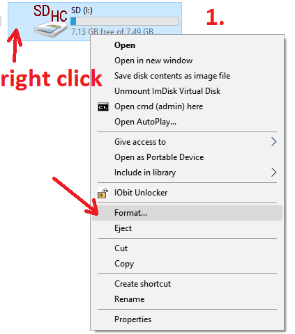
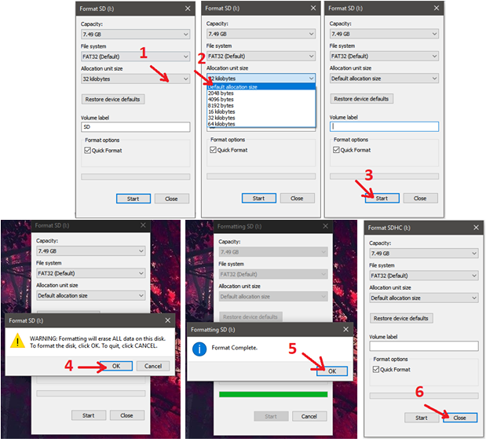

# Etere Documentation Page
This page describes etereshop controller software.
During time software changed multiple times, this documentation version describes 8th software version.  
Due to backwards compatibility this instructions can be applied to previous software versions.

This page mainly describes controller in default state, and how to change this behavior.
## Default controller description
Etereshop usually leave default controller and hardware configuration.  
Default controller is small box with 2 wired buttons and 1 large connector for suit.
Configuration can be different containing multiple connectors and less or more buttons.  
Currently all controllers for suit have SD card inside with effect files and configuration files.

## Default controller work instructions
For normal controller work, user plugs power to suit and connects controller to suit connector.  
### Initialization
- Controller starts initialization and checks SD card availability
    - If SD card not available controller will signal **red**/**black** 
 
Solution

    Firstly check physical card state.  
      - Please check SD card is inside and it's plugged correctly, controller has spring mechanism inside, and rarely after re-plug you can push SD card over slot.  
      - Another problem can be with software part. Check that SD card can be found by PC, and check it's file system is FAT32 

Windows format instructions

            
          
        

        

Mac OS format instructions

          [Text instruction](https://support.mygeeni.com/hc/en-us/articles/360006585013-How-to-Format-SD-card-to-FAT32-in-Mac-OS-)  
          [Video instruction (YouTube)](https://www.youtube.com/watch?v=YjbzpcvOMi4)
        

    

- Controller tries to load `config.txt` file.
    - If file not detected controller will signal **yellow**/**red** 

Solution
 Please check that `config.txt` file exists on sd card.  
        - If not, you can copy this file from another controller from repair kit.  
        - Also you can check links provided by manager team. There can be found all SD card files we sent on cloud storage.
        

- Controller load's effect list, and checks existence of special files.
- Controller notify user it's ok by glowing in **white**.
- Controller security check. 

More info

    Etereshop always checks every controller sent to customer. So we always perform activation on our side. If error happened controller will signal with  **red** / **blue**.
    

- Controller apply preferred user mode, and performs `play.autostart` if it is set;  

### Active state
After initialization controller is in `blackout state`. This state simply turn's off all led's connected.  
User can click on buttons to change current effect. By default first button changes effect to next and another changes effect to previous. If you press any button for 1.5s and release it you will automatically moved to `blackout state`.

> **Note:** Even if led's are not glowing, they still consume power.  
> Unplug power connectors from suit when suit is not in use. 
### Shutting down
We recommend going to `blackout` and only after this unplug power to reduce load on batteries. Simply set `blackout` by changing effect or keeping button pressed for 1.5s and releasing. After this, unplug controller and batteries.

## Effect Files
Effect file is actually record of realtime show, provided by more complex software. At end of file, software simply reopens file at beginning. Smooth cycled effects are made by starting and ending effect on same place.  
`Effect ID` is number after letter "**`S`**". So effect named `S12.txt` has `Effect ID` = 12.  
If `Effect ID` match - controller will work with both effect, but first effect in alphabetical order will be used for `Radio work` or `Playlist Mode`, no other problems will be faced.

There is no reliable way to visualize effect on PC, only controller software can read effect files. If you try to open effect on your PC you will see random symbol mash. To confidently navigate your file you can customize effect name.

To custom effect name must start from S`255` and have `.txt` format (255 can be changed to any other preferred `effect id`).
Custom name examples:
- S12 Lava.txt `(effect id = 12)`
- S134_flag 5 stars.txt `(effect id = 134)`
- S1_2.txt `(effect id = 1)`

> **Note:** Effect files not starting with 'S' and not containing number after 'S' will not be found by controller even if format is `.txt`.  

> **Note:** Please use only english letters and numbers for effect names. Effect names containing other symbols can influence controller work.

## Play Modes
There are multiple controller modes. Modes define what happens on button click, on radio receive and other stuff.  
Default mode is [**Manual**](modes/Manual.md). It can be changed by setting `play.default`. All modes are described at the end of `Log.txt` file.  
Mode summary: 
- Manual Mode
  - Simply switches effects by button clicks, allows to switch between all found effect files. After last effect set's blackout.
  - Color Code -> **yellow**
  - [**Extended Manual mode description page**](modes/Manual.md)
- Playlist Mode (or Show Mode)
  - Read's `show.txt` file and switches effects according to timings provided. On button click starts, other clicks will be ignored. When you perform reset by keeping button pressed for 1.5s and releasing, playlist stops, and blackout is set.  
  At the end of playlist last effect set will stay playing.
  - Color Code -> **cyan**  
  - Needs special file `show.txt` to be indexed in change list.
  - [**Extended Playlist mode description page**](modes/Playlist.md)
- Auto Mode
  - Automatically changes effects one after one after time (in milliseconds) defined in `auto.txt` file. After last effect, 1st effect will be set.
  - Color Code -> **purple**  
  - Needs special file `auto.txt` to be indexed in change list.
  - [**Extended Auto mode description page**](modes/Auto.md)
- Test Mode
  - Has multiple patterns useful for detecting problems in wiring and finding broken led's. On button click changes current test state to next.
  - Color Code -> **white dots**  
  - [**Extended Test mode description page**](modes/Test.md)
- Art-Net Mode  
  - Allows Realtime Control through Wi-Fi using special software on your PC. Please not use this mode on large scenes, Wi-Fi on such places has large instability and your suit can often have disconnects.
  - Color Code -> **light blue**  
  - Wi-Fi connection must be configured for controller, to make this mode visible in change list.
  - [**Extended Art-Net mode description page**](modes/ArtNet.md)

### How to change Play Mode
To perform mode change on default configuration:
- During work
  - Press any button for 5 or more seconds.
  - Suit will start blinking in colors. Color changes every 1.5 seconds.
  - Release on preferred mode `Color Code`.
  - >**Note:** Mods not available ( like not having playlist file on card ) will not be indexed there.
- On startup
  - Connect SD card to your PC.
  - Find and open `config.txt` file there
  - add line `play.default=Playlist;` where `Playlist` can be changed to other mode. You can use numbers to change mode.
  - On launch controller will set preferred mode.
  - >**Note:** Mods, mode status, and ID of each mode listed at the end of `log.txt` file.  
  
### Change brightness
- Using `config.txt` file
  - Add line `led.brightness=30%` to config file or change existing.
- Using special file
  - Create file `bright.txt` with value from 0-255. It will be used instead default or value from `config.txt` file.
> **Note:** Default brightness is 70%. Please note that 50% and 70% can look close, but power consumption differ highly.

### Radio control
Our controllers can have a lot more reliable way to communicate each other using radio modules.  
All information about radio control can be located on special page.  
[**Radio control page**](Radio.md)

## Other pages

[**Configuration file page**](Configuration.md) - contains extra data about configuration possibilities.  
[**Button customize page**](Button.md) - contains guide how to change brightness using buttons.

[**Playlist file creation page**](modes/Playlist.md#File_creation)  

[**Update instruction page**](Update.md)  
[**Radio control page**](Radio.md)  
[**Microphone page**](Mic.md)

Modes description pages:
- [**Manual mode description page**](modes/Manual.md)  
- [**Playlist mode description page**](modes/Playlist.md)  
- [**Auto mode description page**](modes/Auto.md)  
- [**Test mode description page**](modes/Test.md)  
- [**Art-Net mode description page**](modes/ArtNet.md)  