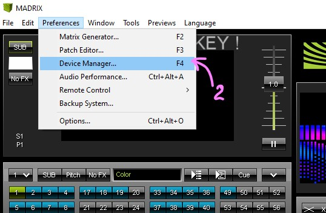

[Return to main page](../README.md)

# Wi-Fi Configuration
This page describes Wi-Fi Configuration. Wi-Fi used for Art-Net realtime control and web interaction with controllers made for large amounts of led's.

## Available settings
Wi-Fi configuration contains multiple parameters

- `wifi.mode=AP;` where `AP` can be:
  - `OFF(0)` - Wi-Fi functionality not used, modes using wi-fi will not appear in list.
  - `STA(1)` - Controller connects to existing network in station mode.  
    >**Note:** `wifi.ip` wanted by controller must be free on your AP.
  - `AP(2)` - Controller creates it's own network as Access Point.  
    >**Note:** due to Wi-Fi standard, networks with same SSID(name) can't be set. Check that network with same SSID not in radius.  

- `wifi.ssid=ETERE-NETWORK;` - SSID of network to connect (for STA mode) or network to set (for AP mode).
- `wifi.password=Secured4897;` - network password, leave empty for open network.

Controller must have configured other network settings. Please note, that on STA mode, `wifi.ip` and `wifi.subnet` must be in same subnet with target AP.

[How to get your network IP and Gateway (Router for MAC)](https://www.online-tech-tips.com/computer-tips/find-wireless-access-point-ip-address/)

>**Note:** IP used must be free (So don't use your PC IP).

- `wifi.ip=192.168.4.99;` - controller ip. User uses this IP to access controller.
- `wifi.subnet=255.255.255.0;` - subnet, must be same with target Access Point.
- `wifi.gateway=192.168.4.1;`- must be same with target Access Point

>**Note:** when using in AP mode, gateway and ip must have same sub-network. For subnet `255.255.255.0` first 3 numbers must be same.

Wi-Fi configuration not used on startup. Connection performed only on actual need, like changing mode to Art-Net.

To connect controller to your network - copy following lines to `config.txt`;
```
wifi.mode=STA;

wifi.ssid="Local WiFi Network"; //If your ssid contains spaces, place name inside ""
wifi.password=12345678;

wifi.ip=192.168.1.99; //controller IP
wifi.subnet=255.255.255.0;
wifi.gateway=192.168.1.1;
```
Please use english named networks. 
Refer [How to get your network IP and Gateway (Router for MAC)](https://www.online-tech-tips.com/computer-tips/find-wireless-access-point-ip-address/) to make sure your sub-network is `192.168.1.XXX`, overwise change ip and gateway.

## Quick start

You can use default network name, password and ip-configuration to set network.
By default, controller configured to set it's own network named `Etere-Network` with password `Secured4897`. Device located at `192.168.4.99`;

>**Note:** On some older versions `wifi.mode=OFF;` by default, but other configuration is same as described at this page. Simply add line `wifi.mode=AP;` to `config.txt` file to make Art-Net mode available.  

Configure Madrix to control your suit.
- Controller creates it's own or connects to existing network.
- User connects to same network.
- User opens Madrix, and `.msz` setup file with your suit;
    - If Madrix fresh installed, You should go to:  
    Preferences -> Device Manager -> Art-Net tab -> **`Enable`**  checkbox must be set. 
        <details><summary>Picture Instructions</summary>

          
          
          
          
          
        </details>
        From this moment Madrix started sending data to Network.
- On Preferences -> Device Manager -> Art-Net tab  
  You can change target device if needed. By default we use `192.168.4.99` for Setups we send to customers.

Suit started glowing in same way as shown in Madrix central window.

## Notes
We highly not recommend usage of Wi-Fi connection on scenes. Wi-Fi can't reliably work inside rooms with high power devices. Even if during repetitions all ok, that not means all will be ok when a lot of phones and other devices will be inside one room working together.  

Use this mode only for effect's choosing and checking that effects are suitable for your show. If you really want use this mode during shows, you should understand risks of Wi-Fi connection break.

When controller used as Access Point, it forced to process all requests done by user PC. This will lead to frame loss due to programs trying to access internet through controller. Close messenger software and browsers to reduce side load on controller when it used as Access point.

Industrial level Wi-Fi routers should be used, home routers usually loose frames during work. Our tests told us, that even phones with Access Point better at modem routing than home routers.

Also note, that large suit's can be controlled through Wi-Fi, but framerate will be extremely low and frame loss can be really critical.

More info about optimizations to be made specific for your suit. How to configure multiple suits and other stuff can be found on [Art-Net Mode Page](modes/ArtNet.md).

## Color codes
Controller shows color codes only for STA (Station Mode).
- State disconnected:
  - While controller not connected.
  - CODE: Light blue color.
- State No SSID avail:
  - When controller after time can't find your network.
  - CODE: Purple.
- State Connect Failed:
  - Target network refused connection.
  - CODE: Orange.
- State Connect Succeed:
  - Once connected, suit will come green
  - CODE: Green.

## Extras
Our newest controller currently support web page + normal work.  

Web page similar to Emergency web page, but manual control part allows you to change effects, and change work speed, brightness and mode.

To enable web page during work add:
```
wifi.web=1;
```
To check availability of this mode, refer to `log.txt` file, scroll to wifi section, and check that this parameter exists.  
You access web page by typing `wifi.ip` you set in config.txt file in browser address line.
For default configuration web page located at `http:/192.168.4.99/`