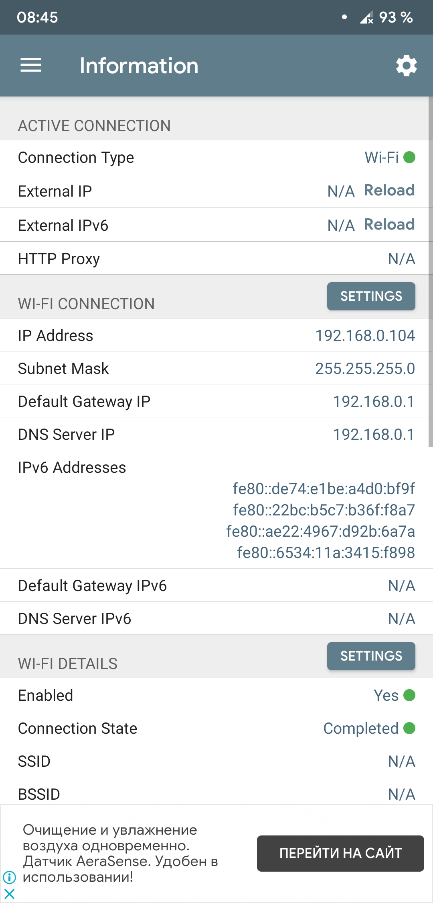

# Wifi Station Mode (STA)
This page describes **STA** or **station mode** or **network client** mode when controller connects to existing Wi-Fi network.  

## Introduction
To interact through Wi-Fi network with controller, controller must be in same network with your device.  

Usually devices connect to network using dynamic IP so, modem device usually gives you random address. For controller usage we recomend and always use static IP.

You don't need any Internet Access in your network to interact with controller.

To perform configuration we should know some details about network

## Step 1 

To configure controller right way we should know:
- Network SSID (or network Name)
- Network Password
- Network subnet mask (looks like `255.255.255.0`)
- Network default Gateway (looks like `192.169.0.1`)
- Choose a valid IP for controller

Windows instructions:
<details> <summary>Pictures</summary> 

  
 
   
</details>  

Android instructions:
<details> <summary>Pictures</summary> 

Newer Android versions allow you to find network parameters
  
 
Or you can use app


</details>  

## Step 2 Choosing IP
Now we know target network parameters
```
SSID = ETERE_SHOW_2
Password = Secured4897

ip = 192.168.43.53 //PC IP (do not use)
subnet mask = 255.255.255.0
gateway = 192.168.43.1

```
Now about choosing static IP for controller.  
Subnet mask divide network to subnetworks, for correct work controller must be in same network with your device.

in PC ip:
```
192.168. 43.|53
255.255.255.|0
  subnet    |address in subnet
```
Choose address in same subnet but different from allocated by PC or other devices.

> We usually use 99 address for controller 1  
98 for controller 2  
97 for controller 3  

so for ths example controller full ip is `192.168.43.99`
## Step 3 Configure

Open `config.txt` located at controller SD card.

Add following lines there:

```
wifi.mode=STA;

wifi.ssid=ETERE_SHOW_2;
wifi.password=Secured4897;
wifi.ip=192.168.43.99;
wifi.netmask=255.255.255.0;
wifi.gateway=192.168.43.1;
```

For `wifi.ip` use choosen controller static IP. Other fields simply copied from **step 2**.

Now controller will use this parameters for default Wi-Fi interaction:  
- [**Art-Net mode**](modes/ArtNet.md)
- Web controll page  
  > when `wifi.web=1;`

To access controller use `wifi.ip`
  > Use `wifi.ip` in Art-Net softwre or as browser address.

## Step 4 Actual connecton
Controller connects to network only when Wi-Fi needed for work.  
> How to use Art-Net mode described [**here**](modes/ArtNet.md)  
> When web functions used, controller connects immediatly.

Color codes:
- Blue blinking -> Connection in progress.
- Blue blinking stops and repeats -> Check network configuration, router rejected controller connection (or maybe this IP already used).
- Purple blinking -> SSID not found near device.
- Orange -> Router respond that connection data incorrect.
- Green -> Connection suceed.


Once connection failed (router disconnected) blue blinks start again.

You can use some winows tools to find out that controller present in network, or find out unused addresses.

   

## Extra

We noticed that mobile hotspot is quite effective and use it for testing purposes (range lower than default router, but speed is fine).  
Always mobile hotspot has following configuration:
```
wifi.ssid=HOTSPOT_AP_NAME;
wifi.password=HOTSPOT_AP_PASSWORD;

wifi.ip=192.168.43.ADDR_HERE;
wifi.netmask=255.255.255.0;
wifi.gateway=192.168.43.1;
```
So you don't need to perform **Step 1** and can use configuration above.