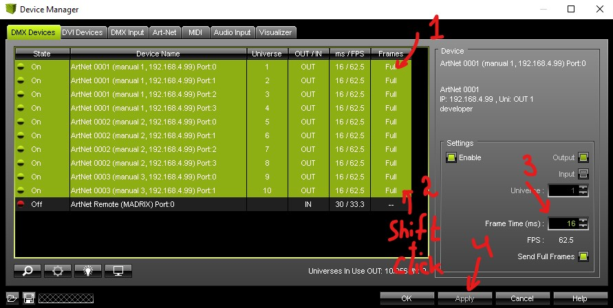

[Return to main page](../README.md)

# Art-Net Mode description
This page describes Art-Net mode. Art-Net mode allow you to control your suit using special software on your PC through Wi-Fi.

## Default Interaction
> This part duplicates WiFi Quickstart example. 

By default, controller configured to set it's own network named `Etere-Network` with password `Secured4897`. Device located at `192.168.4.99`;

>**Note:** On some older versions `wifi.mode=OFF;` by default, but other configuration is same as described at this page. Simply add line `wifi.mode=AP;` to `config.txt` file to make Art-Net mode available.  

Configure Madrix to control your suit.
- Controller creates it's own or connects to existing network.
- User connects to same network.
- User opens Madrix, and `.msz` setup file with your suit;
    - If Madrix fresh installed, You should go to:  
    Preferences -> Device Manager -> Art-Net tab -> **`Enable`**  checkbox must be set. 
        

Picture Instructions

          
          
          
          
          
        

        From this moment Madrix started sending data to Network.
- On Preferences -> Device Manager -> Art-Net tab  
  You can change target device if needed. By default we use `192.168.4.99` for Setups we send to customers.

Suit started glowing in same way as shown in Madrix central window.

## Radio Work
- Radio Ignored during Art-Net mode.\

## Buttons
- Buttons doesn't affect Art-Net work.

## Availability
This mode available only when `wifi.mode=STA;` or `wifi.mode=AP;`;

You can find it at fifth position in que (or lesser if other mods unavailable). Suit will glow in light blue.

## Technical details
Mode prefix is `[art]` inside log file.  

Information about Wi-Fi and how to change Wi-Fi connection from defaults can be found on [Special Page](../Wifi.md).  

Art-Net sends frame each some amount of milliseconds defined at Special Software.
You can change this values in Madrix

Picture Instructions

  

Controller can work through limited amount of frames per second.
